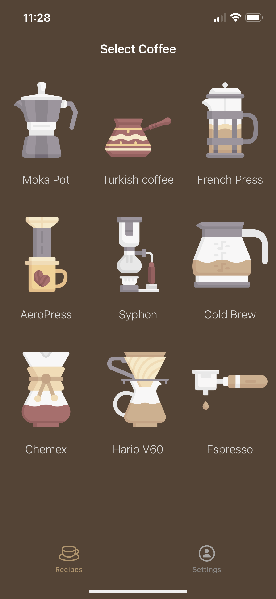
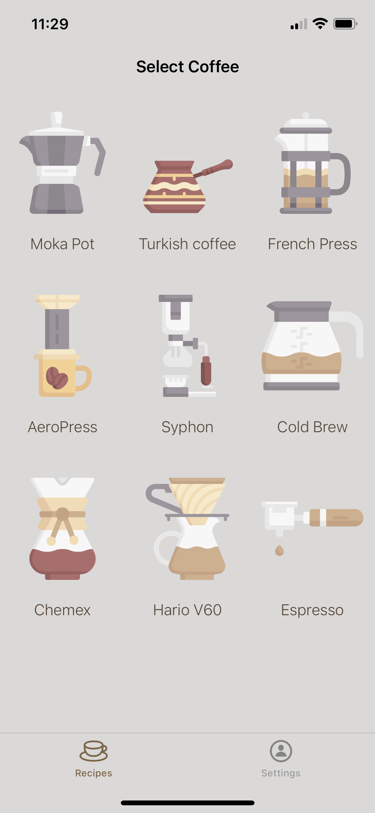
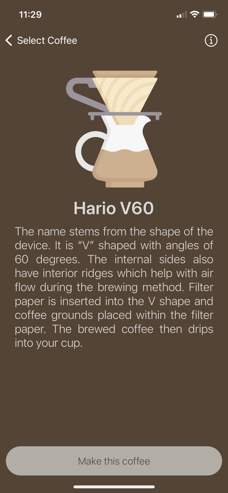
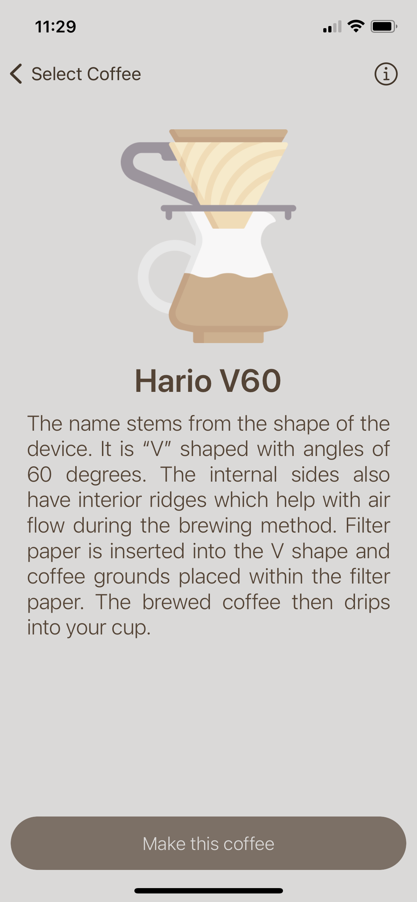
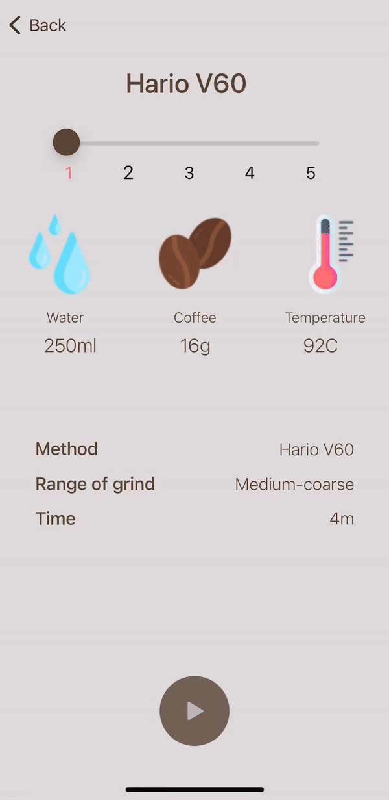

<p align="center">
   <br>
  <h1 align='center' margin-top=0px paddint-top=0px > CoffeeBee </h1>
</p>

<p align="center">
An app that will help you prepare your favorite coffee using any brewing method: Aeropress, French-press and more. The application will tell you what to do and will count the time needed for a given step.
</p>
<br>
<p align="center">

 
</p>
<br>
<p align="center">

 
</p>
<br>
<p align="center">
<h2 align="center"> Choose a method, prepare the desired amount of water, coffee and follow the guide in the application. </h2>
</p>
<br>
<p align="center">

</p>
<br>
<p align="center">
<h2 align="center">Choose weight unit or change Celsius to Fahrenheit and conversely.</h2>
</p>
<br>
<p align="center">

</p>
<br>
<p align="center">
<h2 align="center">If you want to read more information about selected coffee brewing method tap on information button.</h2>
</p>
<br>
<p align="center">

</p>

## Requirements
1. [Xcode](https://developer.apple.com/xcode/)
2. [CocoaPods](http://cocoapods.org/)

## Set Up
Clone GitHub repository
```
git clone git@github.com:menescots/CoffeeBee.git
```
Install Pods 
```
pod install
```
Open a project 
```
open CoffeeBee.xcworkspace
```
Build the project (⌘+B) and check for any errors. <br>
Run the app (⌘+R) and test it.

## License

Chatter is under MIT license. See the [LICENSE](LICENSE) file for more info.
